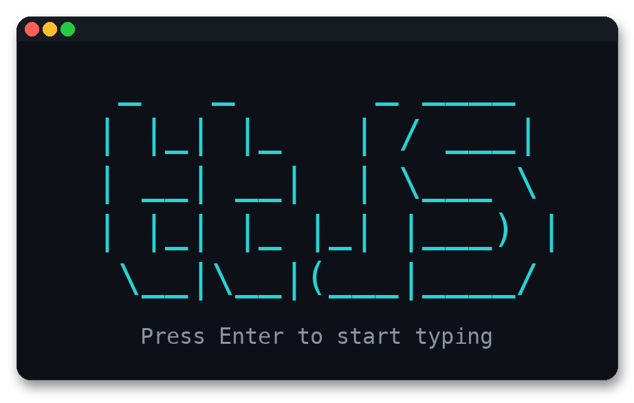

<p align="center">
  
</p>

<h1 align="center">Terminal Typing Test (ttjs)</h1>

A simple terminal-based typing test application that measures your typing speed and accuracy.

## Features

- Real-time progress tracking with color-coded feedback
- Character-by-character accuracy display
- Words Per Minute (WPM) calculation
- Random-word rounds so results stay accurate
- Clean terminal interface
- Help menu (`--help`, or `h` / `?` in the app)

## Installation

No dependencies required! Just make sure you have Node.js installed (v14 or higher).

## Usage

Run the typing test:

```bash
npm start
```

or

```bash
node index.js
```

Show the in-program help menu:

```bash
node index.js --help
```

or

```bash
npm start -- --help
```

## How to Use

1. Press **Enter** on the title screen to start, or **h** / **?** for help
2. A random sequence of words will appear on screen
3. Start typing the text character by character
4. You'll see:
   - **Green** characters = correctly typed
   - **Red** characters = incorrectly typed
   - **Gray** characters = not yet typed
5. Progress, accuracy, and elapsed time are shown in real-time
6. Press **Enter** when finished, or continue typing until you complete the text
7. View your results: WPM, accuracy, and time
8. Press **Enter** to try again, **h** / **?** for help, or **q** to exit

## Controls

- **Enter** (title screen) - Start a typing test
- **h** or **?** (title or results screen) - Show the help menu
- **ESC** - Exit the application (or return from help)
- **Backspace** - Delete last character
- **Enter** (during a test) - Finish typing (or auto-finishes when text is complete)
- **Ctrl+C** - Exit the application
- **q** (on title or results screen) - Exit the application

## Example Output

```
╔════════════════════════════════════════════════════════════╗
║              TYPING TEST - Type the text below             ║
╚════════════════════════════════════════════════════════════╝

Text to type:
─────────────────────────────────────────────────────────────

the of and to in he have it that for they with as not

─────────────────────────────────────────────────────────────

Progress: 15/52 characters
Accuracy: 100.0%
Time: 3.2s

─────────────────────────────────────────────────────────────
Press ESC to quit, Backspace to delete, Enter when finished
```

## License

MIT
